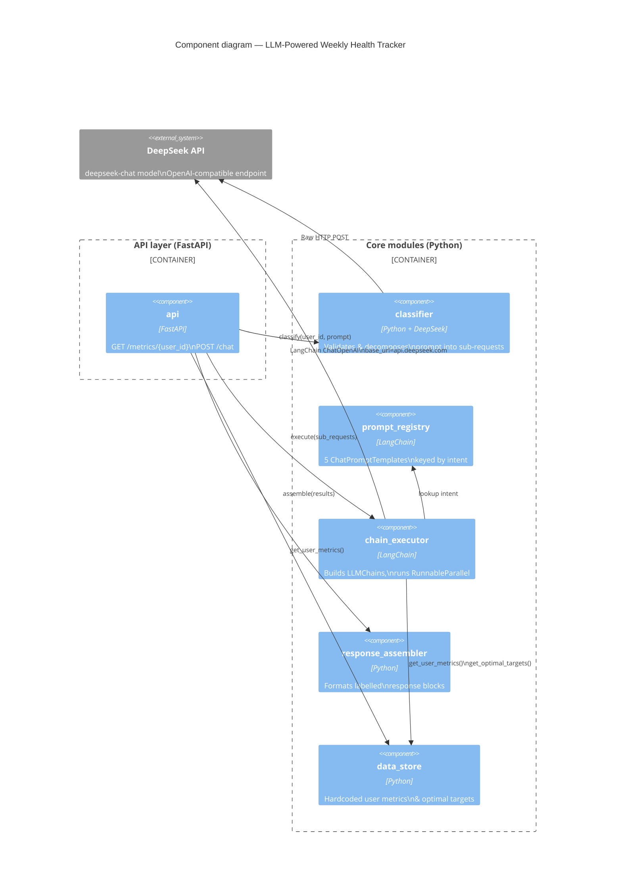

```mermaid
C4Component
    title Component diagram — LLM-Powered Weekly Health Tracker

    Container_Boundary(api_layer, "API layer (FastAPI)") {
        Component(api, "api", "FastAPI", "GET /metrics/{user_id}\nPOST /chat")
    }

    Container_Boundary(core, "Core modules (Python)") {
        Component(classifier, "classifier", "Python + DeepSeek", "Validates & decomposes\nprompt into sub-requests")
        Component(prompt_reg, "prompt_registry", "LangChain", "5 ChatPromptTemplates\nkeyed by intent")
        Component(chain_exec, "chain_executor", "LangChain", "Builds LLMChains,\nruns RunnableParallel")
        Component(assembler, "response_assembler", "Python", "Formats labelled\nresponse blocks")
        Component(data_store, "data_store", "Python", "Hardcoded user metrics\n& optimal targets")
    }

    System_Ext(deepseek, "DeepSeek API", "deepseek-chat model\nOpenAI-compatible endpoint")

    Rel(api, data_store, "get_user_metrics()")
    Rel(api, classifier, "classify(user_id, prompt)")
    Rel(api, chain_exec, "execute(sub_requests)")
    Rel(api, assembler, "assemble(results)")
    Rel(classifier, deepseek, "Raw HTTP POST")
    Rel(chain_exec, prompt_reg, "lookup intent")
    Rel(chain_exec, data_store, "get_user_metrics()\nget_optimal_targets()")
    Rel(chain_exec, deepseek, "LangChain ChatOpenAI\nbase_url=api.deepseek.com")
```