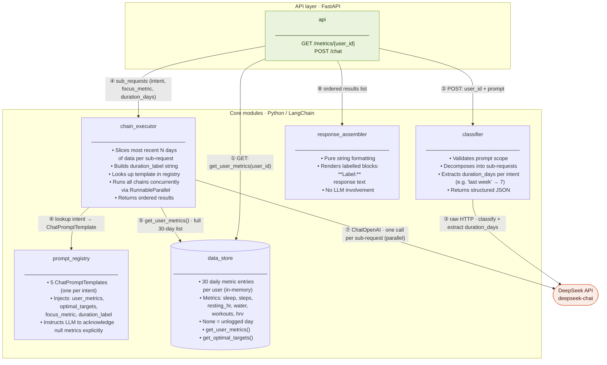

## Request flow — step by step

| Step | From → To | What happens |
|------|-----------|--------------|
| ① | `api` → `data_store` | `GET /metrics` fetches the full 30-day list for the user |
| ② | `api` → `classifier` | `POST /chat` forwards `user_id` + raw prompt |
| ③ | `classifier` → DeepSeek | Raw HTTP call; DeepSeek validates scope, decomposes into sub-requests, and extracts `duration_days` per intent (e.g. "last week" → `7`, "last 2 weeks" → `14`, no duration → `30`). Returns structured JSON only. |
| ④ | `api` → `chain_executor` | Passes the list of sub-requests, each carrying `intent`, `focus_metric`, and `duration_days` |
| ⑤ | `chain_executor` → `data_store` | Fetches full 30-day list, then **slices the most recent `duration_days` entries** per sub-request |
| ⑥ | `chain_executor` → `prompt_registry` | Looks up the `ChatPromptTemplate` for each intent; injects sliced metrics, optimal targets, focus metric, and a human-readable `duration_label` |
| ⑦ | `chain_executor` → DeepSeek | All chains run **concurrently via `RunnableParallel`**; results are reordered to match input order |
| ⑧ | `api` → `response_assembler` | Passes ordered `{intent, label, response}` list; assembler formats into labelled blocks (`**Label:**\nresponse`) with no further LLM calls |
