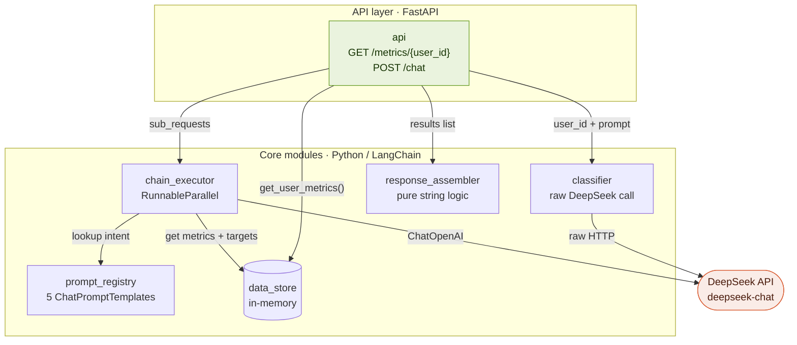

```mermaid
flowchart TB
    subgraph API_LAYER["API layer · FastAPI"]
        API["api
        GET /metrics/{user_id}
        POST /chat"]
    end

    subgraph CORE["Core modules · Python / LangChain"]
        direction LR
        CL["classifier
        raw DeepSeek call"]
        PR["prompt_registry
        5 ChatPromptTemplates"]
        CE["chain_executor
        RunnableParallel"]
        RA["response_assembler
        pure string logic"]
        DS[("data_store
        in-memory")]
    end

    EXT(["DeepSeek API
    deepseek-chat"])

    API -->|"get_user_metrics()"| DS
    API -->|"user_id + prompt"| CL
    API -->|"sub_requests"| CE
    API -->|"results list"| RA

    CL -->|"raw HTTP"| EXT

    CE -->|"lookup intent"| PR
    CE -->|"get metrics + targets"| DS
    CE -->|"ChatOpenAI"| EXT

    style EXT fill:#FAECE7,stroke:#D85A30,color:#4A1B0C
    style API fill:#EAF3DE,stroke:#639922,color:#173404
```