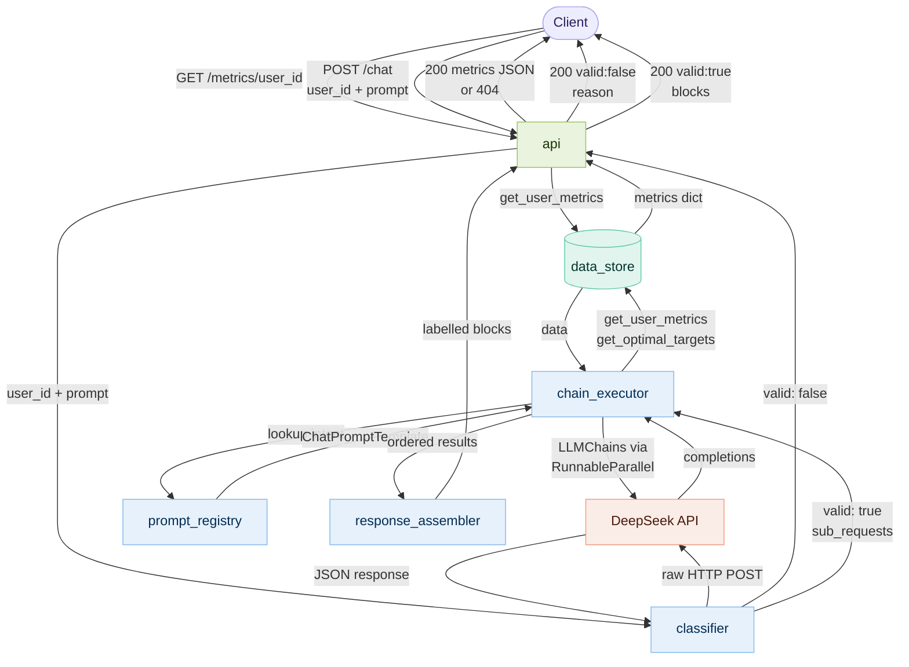

```mermaid
flowchart TD
    A([Client]) -->|GET /metrics/user_id| B[api]
    A -->|POST /chat\nuser_id + prompt| B

    B -->|get_user_metrics| DS[(data_store)]
    DS -->|metrics dict| B
    B -->|200 metrics JSON\nor 404| A

    B -->|user_id + prompt| C[classifier]
    C -->|raw HTTP POST| DS2[DeepSeek API]
    DS2 -->|JSON response| C

    C -->|valid: false| B
    B -->|200 valid:false\nreason| A

    C -->|valid: true\nsub_requests| E[chain_executor]

    E -->|lookup intent| PR[prompt_registry]
    PR -->|ChatPromptTemplate| E

    E -->|get_user_metrics\nget_optimal_targets| DS
    DS -->|data| E

    E -->|LLMChains via\nRunnableParallel| DS2
    DS2 -->|completions| E

    E -->|ordered results| F[response_assembler]
    F -->|labelled blocks| B
    B -->|200 valid:true\nblocks| A

    style A fill:#EEEDFE,stroke:#AFA9EC,color:#26215C
    style DS fill:#E1F5EE,stroke:#5DCAA5,color:#04342C
    style DS2 fill:#FAECE7,stroke:#F0997B,color:#4A1B0C
    style C fill:#E6F1FB,stroke:#85B7EB,color:#042C53
    style PR fill:#E6F1FB,stroke:#85B7EB,color:#042C53
    style E fill:#E6F1FB,stroke:#85B7EB,color:#042C53
    style F fill:#E6F1FB,stroke:#85B7EB,color:#042C53
    style B fill:#EAF3DE,stroke:#97C459,color:#173404
```    